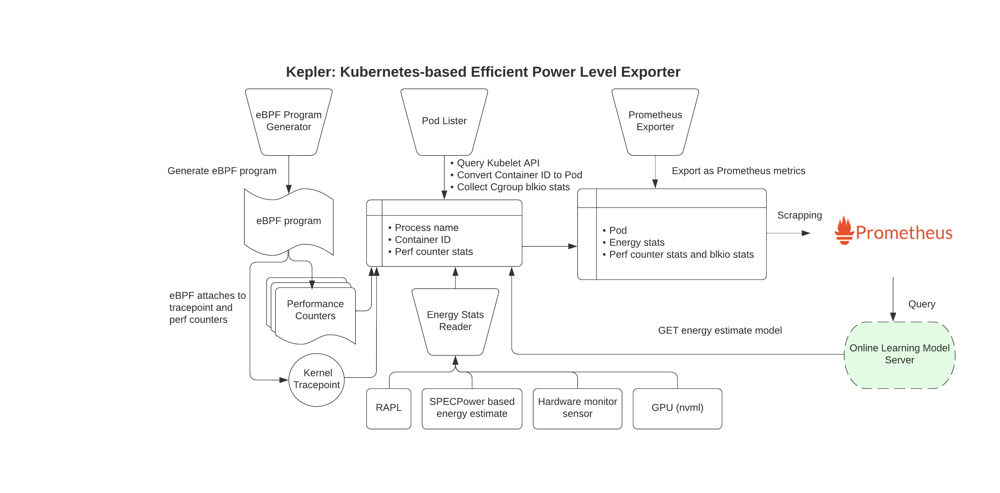

# kepler
Kepler (Kubernetes Efficient Power Level Exporter) uses eBPF to probe energy related system stats and exports as Prometheus metrics

# Architecture


# Talk and Demo
[Open Source Summit NA 2022 talk](doc/OSS-NA22.pdf) and [demo](https://www.youtube.com/watch?v=P5weULiBl60)

# Requirement
Kernel 4.18+, Cgroup V2

# Installation and Configuration for Prometheus
## Prerequisites
Need access to a Kubernetes cluster.

## Deploy the Kepler exporter
Deploying the Kepler exporter as a daemonset to run on all nodes. The following deployment will also create a service listening on
port 9102.
```
# kubectl create -f manifests/kubernetes/deployment.yaml 
```

## Deploy the Prometheus operator and the whole monitoring stack
1. Clone the [kube-prometheus](https://github.com/prometheus-operator/kube-prometheus) project to your local folder.
```
# git clone https://github.com/prometheus-operator/kube-prometheus
```

2. Deploy the whole monitoring stack using the config in the `manifests` directory.
Create the namespace and CRDs, and then wait for them to be available before creating the remaining resources
```
# cd kube-prometheus
# kubectl apply --server-side -f manifests/setup
# until kubectl get servicemonitors --all-namespaces ; do date; sleep 1; echo ""; done
```

## Configure Prometheus to scrape Kepler-exporter endpoints.
```
# cd ../kepler
# kubectl create -f manifests/kubernetes/keplerExporter-serviceMonitor.yaml
```

## Sample Grafana dashboard

 