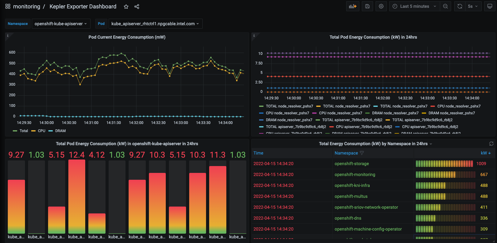

<!--
[](https://godoc.org/github.com/kubernetes/kube-state-metrics)
-->


[](https://twitter.com/KeplerProject)

# kepler
Kepler (Kubernetes Efficient Power Level Exporter) uses eBPF to probe energy related system stats and exports as Prometheus metrics

# Architecture


# Talk and Demo
[Open Source Summit NA 2022 talk](doc/OSS-NA22.pdf) and [demo](https://www.youtube.com/watch?v=P5weULiBl60)

# Requirement
Kernel 4.18+

# Installation and Configuration for Prometheus
## Prerequisites
Need access to a Kubernetes cluster.

## Deploy the Kepler exporter
Deploying the Kepler exporter as a daemonset to run on all nodes. The following deployment will also create a service listening on
port 9102.
```
# build manifests file for VM+Baremetal and Baremetal only
# manifests are created in  _output/manifests/kubernetes/generated/ by default
# make build-manifest
```

if you are running with Baremetal only
```
kubectl create -f _output/manifests/kubernetes/generated/bm/deployment.yaml
```

if you are running with Baremetal and/or VM
```
kubectl create -f _output/manifests/kubernetes/generated/vm/deployment.yaml
```

## Deploy the Prometheus operator and the whole monitoring stack
1. Clone the [kube-prometheus](https://github.com/prometheus-operator/kube-prometheus) project to your local folder.
```
# git clone https://github.com/prometheus-operator/kube-prometheus
```

2. Deploy the whole monitoring stack using the config in the `manifests` directory.
Create the namespace and CRDs, and then wait for them to be available before creating the remaining resources
```
# cd kube-prometheus
# kubectl apply --server-side -f manifests/setup
# until kubectl get servicemonitors --all-namespaces ; do date; sleep 1; echo ""; done
# kubectl apply -f manifests/
```

## Configure Prometheus to scrape Kepler-exporter endpoints.
```
# cd ../kepler
# kubectl create -f manifests/kubernetes/keplerExporter-serviceMonitor.yaml
```

## Sample Grafana dashboard
Import the pre-generated [Kepler Dashboard](grafana-dashboards/Kepler-Exporter.json) into grafana
 


## To start developing Kepler
To set up a development environment please read our [Getting Started Guide](dev/README.md)
